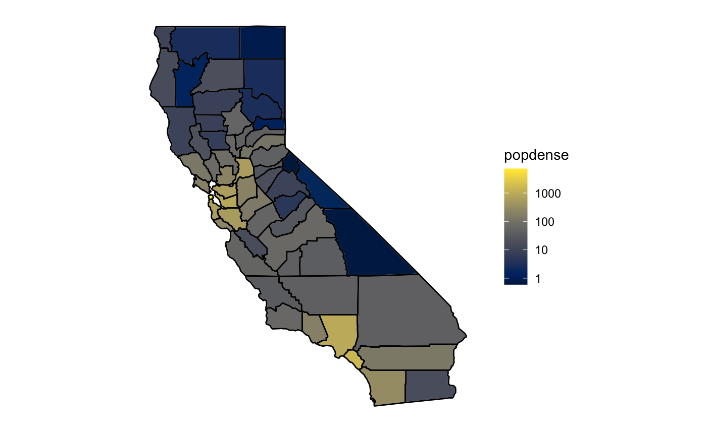

```{r setup, include=FALSE}
knitr::opts_chunk$set(echo = TRUE)
```

```{r, include=FALSE}
library(ggplot2)
library(dplyr)
library(plotly)
library(hrbrthemes)
library(gridExtra)
library(tidyverse)
library(lmerTest)
library(scales)
library(zoo)
source(file="mergeDatasets.R")
```

```{r, include=FALSE}

#make sure date is of class Date
covid$date=as.Date(covid$date)

#we need a specific californoia dataset to calculate seven day running average
cases_sum=aggregate(covid$newcountconfirmed, by=list(covid$date), sum)
deaths_sum=aggregate(covid$newcountdeaths, by=list(covid$date), sum)
#cut date off to avoid NA error
names(cases_sum)=c('date','total_n_cases')
names(deaths_sum)=c('date','total_n_deaths')
#cases_sum=subset(cases_sum, date >= as.Date("2020-03-01") )
```

```{r, include=FALSE}
cases_sum$avg_new_cases=stats::filter(cases_sum$total_n_cases, filter = rep(1/7, 7), sides = 1)
deaths_sum$avg_new_deaths=stats::filter(deaths_sum$total_n_deaths, filter = rep(1/7, 7), sides = 1)
```


```{r 7-Day Average plot, California Cases, include=FALSE}

Cali_Cases <- cases_sum %>%
  ggplot( aes(x=date, y=total_n_cases)) +
    geom_area(fill="lightpink", alpha=0.5) +
    geom_line(aes(x=date, y=avg_new_cases,color='7-Day Running Average')) +
    labs(x="Date", y="Cases per 10k People",title = "COVID Cases Over Time in California", color = "Legend") +
    theme_ipsum()

# Turn it interactive with ggplotly
Cali_Cases <- ggplotly(Cali_Cases)

Cali_Deaths <- deaths_sum %>%
  ggplot( aes(x=date, y=total_n_deaths)) +
    geom_area(fill="lightpink", alpha=0.5) +
    geom_line(aes(x=date, y=avg_new_deaths,color='7-Day Running Average')) +
    labs(x="Date", y="Deaths per 10k People",title = "COVID Deaths Over Time in California", color = "Legend") +
    theme_ipsum()

# Turn it interactive with ggplotly
Cali_Deaths <- ggplotly(Cali_Deaths)

# Cali_Cases PULL THESE UP LATER
# Cali_Deaths PULL THESE UP LATER
```

```{r Similar Country Size and Density Cases, include=FALSE}
who_covid <- read_csv("https://covid19.who.int/WHO-COVID-19-global-data.csv")

iraq_area <- who_covid[who_covid$Country == "Iraq",]  # Iraq has very close area with CA
spain_density <- who_covid[who_covid$Country == "Spain",]  # Spain has very close population density with CA

iraq_area$Date_reported=as.Date(iraq_area$Date_reported)
spain_density$Date_reported=as.Date(spain_density$Date_reported)

iraq_area$avg_new_cases=stats::filter(iraq_area$New_cases, filter = rep(1/7, 7), sides = 1)
iraq_area$avg_new_deaths=stats::filter(iraq_area$New_deaths, filter = rep(1/7, 7), sides = 1)

spain_density$avg_new_cases=stats::filter(spain_density$New_cases, filter = rep(1/7, 7), sides = 1)
spain_density$avg_new_deaths=stats::filter(spain_density$New_deaths, filter = rep(1/7, 7), sides = 1)

Iraq_Cases <- iraq_area %>%
  ggplot( aes(x=Date_reported, y=New_cases)) +
    geom_area(fill="lightpink", alpha=0.5) +
    geom_line(aes(x=Date_reported, y=avg_new_cases,color='7-Day Running Average')) +
    labs(x="Date", y="Cases per 10k People",title = "COVID Cases Over Time in Iraq", color = "Legend") +
    theme_ipsum()

# Turn it interactive with ggplotly
Iraq_Cases <- ggplotly(Iraq_Cases)

Iraq_Deaths <- iraq_area %>%
  ggplot( aes(x=Date_reported, y=New_deaths)) +
    geom_area(fill="lightpink", alpha=0.5) +
    geom_line(aes(x=Date_reported, y=avg_new_deaths,color='7-Day Running Average')) +
    labs(x="Date", y="Deaths per 10k People",title = "COVID Deaths Over Time in Iraq", color = "Legend") +
    theme_ipsum()

# Turn it interactive with ggplotly
Iraq_Deaths <- ggplotly(Iraq_Deaths)

# Iraq_Cases PULL THESE UP LATER
# Iraq_Deaths PULL THESE UP LATER

Spain_Cases <- spain_density %>%
  ggplot( aes(x=Date_reported, y=New_cases)) +
    geom_area(fill="lightpink", alpha=0.5) +
    geom_line(aes(x=Date_reported, y=avg_new_cases,color='7-Day Running Average')) +
    labs(x="Date", y="Cases per 10k People",title = "COVID Cases Over Time in Spain", color = "Legend") +
    theme_ipsum()

# Turn it interactive with ggplotly
Spain_Cases <- ggplotly(Spain_Cases)

Spain_Deaths <- spain_density %>%
  ggplot( aes(x=Date_reported, y=New_deaths)) +
    geom_area(fill="lightpink", alpha=0.5) +
    geom_line(aes(x=Date_reported, y=avg_new_deaths,color='7-Day Running Average')) +
    labs(x="Date", y="Deaths per 10k People",title = "COVID Deaths Over Time in Spain", color = "Legend") +
    theme_ipsum()

# Turn it interactive with ggplotly
Spain_Deaths <- ggplotly(Spain_Deaths)

# Spain_Cases PULL THESE UP LATER
# Spain_Deaths PULL THESE UP LATER
```

```{r, include=FALSE}
ca_counties <- merged
ca_counties$date <- as.Date(ca_counties$date)
keeps <- c("new_casesrate", "date", "Urban_Influence_Code_2013", "MetCode")
ca_counties <- ca_counties[keeps]
```

```{r, include=FALSE}
ca_county_codes <- aggregate(ca_counties$new_casesrate, by=list(ca_counties$date, ca_counties$MetCode), FUN=mean)

names(ca_county_codes) <- c("date", "MetCode", "mean_new_caserate")
ca_county_codes$mean_new_caserate=stats::filter(ca_county_codes$mean_new_caserate, filter = rep(1/7, 7), sides = 1)

levels(ca_county_codes$MetCode) <- c("Non-Metropolitan", "Metropolitan")

county_code_cases <- ggplot(data=ca_county_codes, aes(x=date, y=mean_new_caserate, group=MetCode, color=MetCode)) +
  geom_line() +
  labs(x = "Date", y = "Cases per 10k People", title = "COVID Cases Over Time in California", color = "County Type") +
    theme_ipsum()

county_code_cases <- ggplotly(county_code_cases)
# county_code_cases
```

# Abstract

The COVID-19 pandemic, while ubiquitous worldwide, has differentially affected different segments of the population. Regional demographic factors, such as population density, could have an impact on this respiratory, community transmitted disease. This study addresses the association and impact of demographic factors on COVID-19 rates, particularly in California Counties. California’s counties were selected due to their large range in population densities (1.6 to 17,179.2 people per square mile) and diversity across the rural-urban continuum. State model type. In particular, this study calculates a propensity score to explore if there is a causal relationship between the population density and COVID-19 case rates. The linear mixed model indicates a negative relationship between elder ratio and infection rate and a positive relationship between metropolitan counties and infection rates.Selection bias persisted after propensity scores were included in the model, invalidating our ability to infer a causal relationship between metropolitan locations and infection rates. These findings indicate which areas are at higher risk during pandemic outbreaks and could critically help policymakers allocate funding and healthcare to these regions.

# Introduction

The ongoing COVID-19 pandemic has impacted lives worldwide, but residents of different regions have been differentially impacted. Since COVID-19 regulations have often been handled at the national or state level, the impact of subregional influences on case counts needs to be addressed to allocate aid where it is needed most. Additional aid to vulnerable subregions could hinder the progress of the virus as it spreads throughout an entire country and keep more of the overall population healthy. One particular factor we are interested in is the population distribution over a country, and how differing population densities between subregions plays a role in transmission rates of the disease.

## Main Question

This study looks to answer one main research question:

**What is the relationship between population distribution and COVID-19 case rates within a country, and is it a causal relationship?**

Our main hypothesis for this research question is that population density will have a positive relationship with COVID-19 case rates. Additionally, we hypothesize that a higher population density causes increased COVID-19 case rates. Since COVID-19 is a respiratory illness that spreads readily through the community via the air (Peters, 2020). The primary reasoning behind our hypotheses is that higher densities of people breathing in proximity would theoretically make it easier to transmit the virus. Thus, areas with more people per square mile will have a proportionally higher rate of transmission.

## Data Summary

Our analysis will use the state of California as a proxy for other countries and we will look at daily case numbers from March 2020 to February 2021. The data encapsulates several axes of COVID-19 metrics, including the number of cases, number of deaths, and case-mortality rate. To isolate the problem, we will adjust for other regional socioeconomic factors, such as the percentage of the elderly and household income, to be sure that the results we see are the effect of population density. The sources of data include the country-level WHO dataset (2021), and New York Times data dataset, which has the added advantage of including county-level metrics. Population density, and compounding factors such as socioeconomic data and age demographics are also included. The summaries of and links to these datasets and what they provided is listed in Table 1 below. Model identification and diagnostics, and a propensity score analysis will address the question of the association between population density and COVID-19 rates. Policymakers could use the results of this report to specifically allocate funds to best address the needs of their county. Additionally, the general population or those in the healthcare field may be interested in the results of this report.

Dataset | Components Used
------- | ---------------
[WHO COVID Dataset](https://covid19.who.int/WHO-COVID-19-global-data.csv) | Number of new cases and deaths are calculated by subtracting previous cumulative total counts from the current count.
[NY Times COVID Dataset](https://github.com/nytimes/covid-19-data/blob/master/live/us-counties.csv) | Total COVID cases and deaths per county in each state of the USA
[County Household Sizes and Population Densities](https://covid19.census.gov/datasets/average-household-size-and-population-density-county/data) |  Population density for each county in the USA
[Urban County Codes](https://www.ers.usda.gov/data-products/county-level-data-sets/) | Population Estimate, Number of elders over 65, Housing Density
[Demographic Information](https://www.ers.usda.gov/data-products/county-level-data-sets/) | Poverty estimates, Median household income


# Background

## Proxy For Countries

Our choice to use California instead of any country was because of the data we had access to. While we could compare the population densities between nations and compare the effects of the pandemic on them, we chose not to for two reasons:

1. **Interpretability**: The purpose of our analysis is to provide actionable insights for leaders of a region to determine how to distribute resources. There is no leader of the entire world who decides how to distribute resources among countries. Thus we must work at a scale that is governed by a single body. With California, the governor has control over how resources can be distributed to counties.

2. **Scale**: We would like to have our regions subdivided into the smallest possible chunks to give the best description of how the population is distributed over a region. The level of concentration or distribution of a country's population cannot be quantified without regional data. For example, Canadas population is very concentrated around the southern border despite having large amounts of relatively unpopulated land in the north. The national population density would be lowered by the large amounts of uninhabited area despite the population being relatively concentrated.

To show how our results from California can be used at a national level, we give two examples of countries that have a similar area and similar population density as California:

1. **[Iraq](https://en.wikipedia.org/wiki/Iraq)**: 169,235 square miles compared to 163,696 of [California](https://en.wikipedia.org/wiki/California) (Notably with a similar population density too, at 214 per square mile).

2. **[Spain](https://en.wikipedia.org/wiki/Demographics_of_Spain)**: 237 people per square mile compared to 254 of [California](https://en.wikipedia.org/wiki/California).

Although we do not have access to regional level data for these countries, we can see how they are similar to California geographically.

## Data Specifics

This project utilizes a few different data sources because they each shed a different light on the socio-demographic realities of COVID-19. The different data sources are summarized in Table 1. 

### WHO COVID-19 Dataset

The first data source, the WHO COVID-19 global dataset, was compiled by The World Health Organization to complete their global mission of freely communicating global health data. The target population for this dataset was the entire world population, reported by country of residence. The sampling mechanism was through the reporting of sovereign nations. This sampling mechanism may have had differences between countries as some have more stringent reporting requirements than others. The variables utilized from this dataset were the number of new cases and deaths at a country level. We used this dataset to enhance the analysis at a global level, incorporating nations with similar population densities to California.

### New York Times Dataset

The second dataset is from the New York Times. This data contains county level information about the number of confirmed COVID-19 cases (both new and total). The data is compiled for the New York Times by journalists across the nation who combine info from public health press conferences and meetings. The target population is the entire United States, and the sampling mechanism is, theoretically, every case reported at a state or county level. If a state or a county refused or neglected to communicate that information publicly, the data would not be represented in this database. The variables we used from this dataset were the total number of COVID-19 cases. This dataset was critical to the county-level component of the study, which chose to isolate the effects of population density in subregions which are more evenly urban or rural than the state as a whole.

### US Census Dataset

The third data source is the US census. This Organization is a part of the US government who counts the entire nation every decade. As a census, by definition the target population is every resident of the United States, and their sampling mechanism is to speak to every household in the entire country and count all residents. The main variable that we used from this dataset is the population density per county. This is calculated as the population per square mile. We used this dataset as it could give us the best idea of the true population density. 

## Other work

Similar studies have looked at the effects of population density on the COVID-19 pandemic (Peters, 2020; Wong, 2020; Almagro, 2020). Previous studies have shown that it is an important factor in community-spread diseases (Tarwater 2001). This report adds to the existing literature as it adds the analysis of causality in the discussion.

# Data Exploration

In this section, we will be giving a comparative international view of the COVID-19 pandemic, complimented by county-level data in California. We will be looking at trends in the data and discussing any abnormalities found. 

## Iraq and Spain

First, we looked at the global pandemic rates in each country. Since we are interested in applying the county-level data in California on a national scale, we focused on Spain and Iraq. These two countries which have similar characteristics to California (area and population density).

```{r, echo=FALSE, results='show'}
Spain_Cases
Spain_Deaths
Iraq_Cases
Iraq_Deaths
```

We looked to compare the 7 day running average for Spain and Iraq. 

## California

### Overall

Below are the plots for cases and deaths in California

```{r, echo=FALSE, results='show'}
Cali_Cases
Cali_Deaths
```

We can see there are two waves of the pandemic, with the second being much worse than the first. The week to week fluctuations are suggest that people are catching the disease at certain times of the week (presumably the weekend) and these fluctuations are normalized by the 7-day running average.

### Example Counties

Looking at a few counties as an example, below we can see San Francisco and Inyo counties. The first is a metropolitan county and the second is not.

```{r, echo= FALSE}
ourData = read.csv('Data/final.csv')
plot_by_calif_county = function(place){

  county.specific.data = subset(ourData, county == place)
  #split into month and year
  county.specific.data$mo = strftime(county.specific.data$date, "%m")
  county.specific.data$yr <- strftime(county.specific.data$date, "%Y")
  #aggregate by month
  cases  = aggregate(totalcountconfirmed~mo +yr, county.specific.data, sum)
  dead = aggregate(totalcountdeaths~mo +yr, county.specific.data, sum)
  newd = cbind(cases, dead[,3])
  names(newd) = c("month", "yr", "cases", "dead")
  
  newd$date = as.yearmon(paste(newd$yr, newd$mo), "%Y %m")
  newd$date = as.Date(newd$date)
  newd$case_fatality_per_tenk = (newd$dead/newd$cases) *10000
  
  
  ggplot(newd)+
    geom_bar(aes(x=date, y = case_fatality_per_tenk), stat = "identity")+xlab("Date") +
    ylab("Case Fatality Rate per 10k")+ggtitle(paste0("Monthly Case Fatality Rate for ", county.specific.data$county))+
    theme(plot.title = element_text(hjust = 0.5))+theme_bw()+
    #scale_x_date(date_labels = "%y %b",date_breaks = "1 month")+
    #scale_x_date(date_breaks  ="1 month")+
    scale_x_date(date_labels = "%Y %b",date_breaks = "1 month")+
    theme(axis.text.x = element_text(angle = 90))
}

g1 = plot_by_calif_county("San Francisco")
g2 = plot_by_calif_county("Inyo")
grid.arrange(g1,g2,nrow = 2, ncol = 1)
```


San Francisco has fewer case fatalities compared to Inyo during the entire time period. 

This graph shows the case fatality rates per month for the respective counties. We also intended to plot Alpine county due to the very low population density,  however, people living in Alpine county had no mortalities. This could be due to the fact that nobody has yet had a fatal case of COVID-19. Alternatively, this could be because people in critical condition in this county are moved to another county to receive Critical Care treatment. It is impossible to know this from the information given.

Next, we analyzed the trends in California. Below is a figure depicting the population density of all 58 counties in California. This shows that San Francisco (in the Bay area, central California) has the highest population density. The counties further East (largely mountainous and desert regions) have the lowest population densities. Note the variation in population density across counties, across orders of magnitude



Figure X. Population Density in California. For mapping methods see: Making maps with R)

We also looked at the case count in each of the counties. These are represented in Figures **(X-X)** below. While the pure number of cases changed from July (a relatively low-case point) to January (a relatively high-case point), the relative number of cases in each of the counties does not seem to change. This observation requires further statistical analysis to explore. 


Figure X. July 2020 case count. For mapping methods see: Making maps with R


Figure X. January 2020 case count. For mapping methods see: Making maps with R

## Grouping Response Variable

To simplify our model we will be condensing our response variable by labeling each county as a metropolitan or non-metropolitan county. Codes corresponding to these categories were pulled from the California Demographic data. Having a binary response allows us to perform causal inference from the results of our model. This way we can use non-metropolitan counties as a control group and metropolitan counties as a treatment group.

```{r, echo=FALSE, results='show'}
county_code_cases
```

Looking at the case numbers between our two groups the first smaller wave had more cases per-capita in metropolitan areas, but in the rising of the second wave, the non-metropolitan counties meet and exceed the cases per-capita of metropolitan counties. Interestingly, the dip around the peak of the second wave was almost entirely caused by metropolitan counties, perhaps suggesting people were leaving the city for the holidays.

# Linear Mixed-Effects Model

```{r, include=FALSE}
final=read.csv("Data/final.csv")

which(is.na(final))
final=drop_na(final)
which(is.na(final)) #good

#sapply(final,class)
final$MetCode=as.factor(final$MetCode)
final$county=as.factor(final$county)
final$date=as.factor(final$date)
```
         
```{r, include=FALSE}
#grab our potential predictors and response, MetCode is our treatment group
dat = final[,c("county"  ,'new_casesrate','elder_ratio','HouseDensity.per.square.mile.of.land.area','date','Poverty_Estimate',"Poverty_Percent","Pop_Estimate","MetCode","totalcountconfirmed"),]
#look for any particular parterns. The clearist is household income and povery rates--unsurpisingly
#pairs(Filter(is.numeric, dat))

dat
```

Our proposed model seeks to determine a casual relationship between an area's metropolitan status and COVID-19 infection rates. As previously stated, we assume the independent fixed effects of elder ratio and poverty percent contribute underlying effects in determining both whether a county is labeled as metropolitan and its associated infection rates.

It is under our assumption that metropolitan locations tend to have lower numbers of elderly and higher levels of poverty compared to non-metropolitan areas. 

The lme4 package was used to fit our Linear Mixed-Effects Models. Since the data contained a multitude of observations for different counties over the course of several days, we assumed existing random, unmeasurable effects were present in our data. In this model, we define county and date effects as random effects we cannot control.

Our Linear Mixed-Effects Model takes the following form:

$$y = {X\beta} + {Zu} + {\varepsilon}$$
Where
- $y$ represents an $N \times 1$ vector of our fatality rates. 

- $X$ is a $N \times p$ matrix of our predictor variables. 

- $\beta$ is a $p \times 1$ column of our fixed effects coefficients. 

- $Z$ is a $N \times q:groups$ matrix for the $q$ random effects for our county and state variables. 

- Finally, $\epsilon$ captures the portion of $y$ not included by the rest of the model.

(McCullagh, P, & Nelder, J. A. (1989). Generalized Linear Models, 2nd ed. Chapman & Hall/CRC Press.)


The distribution of infection rates was highly right skewed, so a $log(x+1)$ transformation was applied to the numeric variables in the data. 

```{r, echo=FALSE, message=FALSE, warning=FALSE}
par(mfrow=c(1,2))
#Transformation
#check the distribution of our response and predictors
hist(final$new_casesrate,col = rainbow(5), xlab="InfectionRate", main="Distribution before Transformation") #this is very right skewed
#normalize
#hist(log(final$new_casesrate),col = rainbow(5)) #lots better
#adjust for the 0 value rates
hist(log(final$new_casesrate+1),col = rainbow(5),xlab="log(InfectionRate+1)", main="After Transformation")

dat=dat[-c(which(final$new_casesrate<0)),]

log_dat=log((Filter(is.numeric,dat))+1)

transformed= cbind(log_dat, Filter(is.factor,dat))
#transformed
transformed=(drop_na(transformed))
```

A quick comparision of the average infection rates between our treatment and control indicates a higher average present in metropolitan coded counties.

```{r, echo=FALSE}

boxplot(transformed$new_casesrate~transformed$MetCode,main='Comparision of Averages Between Groups',
xlab='MetroCode',ylab='Infection Rate',col=rainbow(5))
```

A Mixed Effects Linear model was fit without the use of propensity score weighting.

In the case of this model, our treatment was `MetroCode=1` (metropolitan county) and our control was `MetroCode=0` (non-metropolitan county)

```{r, echo=FALSE}

model1 = lmer(new_casesrate~(elder_ratio)+factor(MetCode)+I(Poverty_Percent/100)+(1|county)+(1|date),data = transformed)
summary(model1)

```

We found the treatment effect to be statistically significant at $p=0.1$. Poverty rates were not found to have a significant effect while elder ratios were statistically significant with $p<0.001$. 

However, our previous analysis leads us to believe both poverty rates and elder ratios influence whether an area is determined as metropolitan or not. 

To assess the extend of this bias during assignment, we will compare the imbalance present.

MetroCodes against Elder Ratio

```{r, echo=FALSE}

transformed$MetCode=as.numeric(as.character(transformed$MetCode))

## Balance analysis
model2 = lm(elder_ratio~MetCode,data = transformed)
summary(model2)#clearly there is bias between 

```

MetroCodes against Poverty Ratio

```{r, echo=FALSE}


## Balance analysis
model3 = lm((Poverty_Percent/100)~MetCode,data = transformed)
summary(model3)#clearly there is bias between 

```

In both cases there appears to be strong imbalance between MetroCode levels and our two covariates as $p<0.01$. This suggests there may be selection bias present. We aim to use propensity score to reduce these effects.

Propensity scores were determined using logistic regression with our treatment as the response against our two covariates. The probabilities estimated by the logistic regression model were processed and inverted. The final scores were used as weights in the final Linear Mixed Model. 

*Pscores*
```{r, echo=FALSE}
#transformed$MetCode = #relevel(transformed$MetCode,ref='0')


transformed$MetCode = relevel(dat$MetCode,ref="0")
models = glm(MetCode~(elder_ratio)+I(Poverty_Percent/100),family=binomial(logit), data = transformed)
prob = models$fitted.values
pscore = ifelse(transformed$MetCode=="1",prob,(1-prob))
transformed$pscore=pscore


quantile(pscore)

#pscore
weight = 1/pscore
summary(models)

col.alpha<-function(color, alpha){
  code=col2rgb(color)/256
  rgb(code[1],code[2],code[3],alpha)
}
#better  hist
hist(unique(transformed$pscore[transformed$MetCode==1]), breaks=25, col=col.alpha("red",.6), freq=F, ylim=c(0,5), xlab="Propensity Score", ylab="", main="Propensity Score Distribution")
hist(unique(transformed$pscore[transformed$MetCode==0]), breaks=25, col=col.alpha("lightblue",.6), freq=F, ylim=c(0,5), xlab="Propensity Score", ylab="", main="",add=T)
legend(.4, 5, legend=c("Metro", "NonMetro"),
       col=c("red", "blue"),fill = c("red", "lightblue") )

#likely won't be much change, the confunding effects are too large
```

The distribution of the propensity scores indicates there is not a significant difference in scoring between the treatment and control group despite the existence of confounding effects. The propensity scoring and matching method used may be improved upon with alternate methods.

## Final Weighted Model
```{r, echo=FALSE}

model_new7 = lmer(new_casesrate~(elder_ratio)+factor(MetCode)+I(Poverty_Percent/100)+(1|county)+(1|date),data = transformed,weights = weight)
summary(model_new7) #1|pred -> predbecomes random effect here
```

The final mixed effects model with propensity score weights is not significantly different than the model without. The difference in estimates is not marginally different from the unweighted model. Our treatment group has a positive relationship with the infection rate ($p<0.01$), indicating metropolitan counties may have high infection rates than non-metropolitan counties. 

# Sensitivity Analysis

```{r, echo=FALSE}

plot(model_new7,type=c('p','smooth'))

qqnorm(unique(resid(model_new7)))
qqline(resid(model_new7))

anova(model_new7)
```

# Causal Interpretation

After the addition of propensity scores in our Linear Mixed Model, we observed very little change in the treatment effect. The biases introduced by poverty and elder ratios are not significantly reduced after weighting. It is therefore highly possible that there still exists selection bias which invalidates our ability to conduct proper causal inference.


# Conclusion
In this study we examined the relationship between Covid-19 infection rates per 10,000 people in California and population density. Other variab The data on infection rates was collected daily on the county level from March 2020 to February 2021. 

# References

1. Almagro, M. (2020, September 22). Racial Disparities in Frontline Workers and Housing Crowding During COVID-19: Evidence from Geolocation Data by Milena Almagro, Joshua Coven, Arpit Gupta, Angelo Orane-Hutchinson :: SSRN. SSRN. https://papers.ssrn.com/sol3/papers.cfm?abstract_id=3695249

2. Making maps with R. (n.d.). Retrieved March 05, 2021, from https://eriqande.github.io/rep-res-web/lectures/making-maps-with-R.html

3. Mortality Risk of COVID-19 - Statistics and Research. (2021). Our World in Data. https://ourworldindata.org/mortality-risk-covid

4. Peters, D. J. (2020, June 1). Community Susceptibility and Resiliency to COVID-19 Across the Rural‐Urban Continuum in the United States. Wiley Online Library. https://onlinelibrary.wiley.com/doi/full/10.1111/jrh.12477

5. Tarwater, P. M. (2001, July 1). Effects of population density on the spread of disease. Wiley Online Library. https://onlinelibrary.wiley.com/doi/abs/10.1002/cplx.10003#:%7E:text=Although%20an%20epidemic%20is%20likely,to%2098%25%20of%20the%20time

6. Wong, D. W. S. (2020, December 23). Spreading of COVID-19: Density matters. PLOS ONE. https://journals.plos.org/plosone/article?id=10.1371/journal.pone.0242398


# Session info {-}

```{r}
sessionInfo()
```


